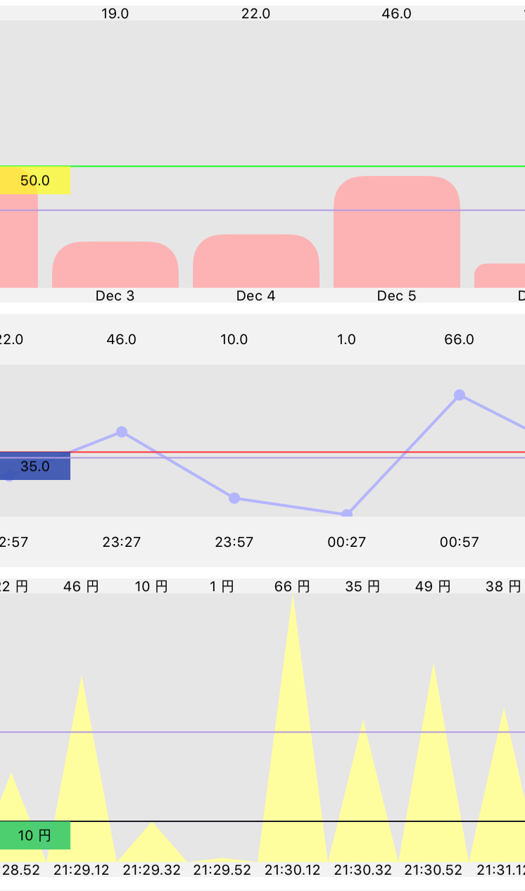

# PlugAndChugChart

PlugAndChugChart is simple scrollable chart written in Swift.

<p align="center"></p>

# Features


[](https://github.com/Carthage/Carthage)
[](http://mit-license.org)
[](https://developer.apple.com/swift)

- Several types of chart
- Scrollabel chart
- Support @IBDesignable and @IBInspectable
- Support Swift 3.0

## Demo App

To run the example project, clone the repo, and run `pod install` from the Example directory first.

Open `Example/PlugAndChugChart.xcworkspace` and run `PlugAndChugChart-Example` to see a simple demonstration.

## Usage

### Initialization

***PlugAndChugChart*** is subclass of UIScrollView, and can be initialized in a way same as UIScrollView.

```swift
let chart = PlugAndChugChart(frame: CGRect(x: 10, y: 20, width: 200, height: 300))
```

`PlugAndChugChart` is available in Interface Builder.
Set custom class of `UIScrollView` to `PlugAndChugChart`

```swift
@IBOutlet weak var chart: PlugAndChugChart!
```

### Data Setting
You set `chartValues` and `xAxisLabels` to display chart on view.

```swift
let chartData: [CGFloat] = [30, 50, 19, 22, 46, 10, 1, 66, 35, 49, 38, 17]
let dataLabels: [String] = ["Jan", "Feb", "Mar", "Apr", "May", "Jun", "Jul", "Aug", "Sep", "Oct", "Nov", "Dec"]

chart.chartValues = chartData
chart.xAxisLabels = dataLabels
```
If you want to set `Date` type in x-Axis label, have only to set `minimumDate`.

```swift
chart.chartValues = chartData

chart.dataLabelType = .date
chart.minimumDate = Date()
```

more optional setting

```swift
chart.dateStyle = .hour
chart.dateInterval = 2
```

### Chrat Style

`PlugAndChugChartStyle` have `.bar`, `.round`, `.jaggy`.
```swift
chart.style = .round  // default is .bar
```


### Layout
If you customize `PlugAndChugChartComponent` layout, change layout properties.
```swift
chart.setBarWidth(rate: 0.9)
chart.setBarAreaHeight(rate: 0.9)
chart.setMaxChartValue(rate: 0.6)
chart.setComponentArea(width: 100)
```

## Requirements

- iOS 8.0+
- Xcode 8.0+
- Swift 3.0+

## Installation

PlugAndChugChart is available through [CocoaPods](http://cocoapods.org). To install
it, simply add the following line to your Podfile:

```ruby
pod "PlugAndChugChart"
```

## Author

Kyohei-Sakai, nico_f00tb@yahoo.co.jp

## License

PlugAndChugChart is available under the MIT license. See the LICENSE file for more info.
